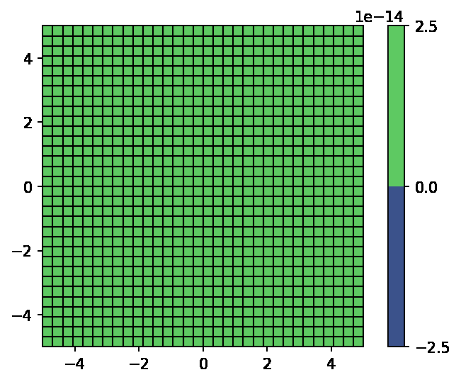

# Numerical Solution of the Scalar Wave Equation Using FEM

This repository contains a finite element method (FEM) solver for the scalar wave equation, developed for simulating wave propagation in 2D domains.

## 🚀 Features
- **Scalar wave equation solver** using quadrilateral finite elements (Q4)
- **Newark-Beta time integration** for stable dynamic analysis
- **Hann-windowed source** for smooth pulse generation
- **Visualization tools** for wave propagation (contour plots, GIFs)

## 📊 Results

\\
*Figure 1: Wave (Pressure)*

## 📧 Contact
For questions, contact [Mohammad Taha](mailto:mtaha@connect.ust.hk).
